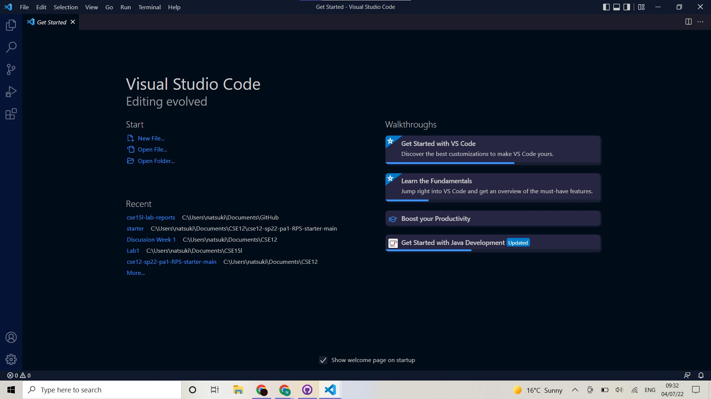
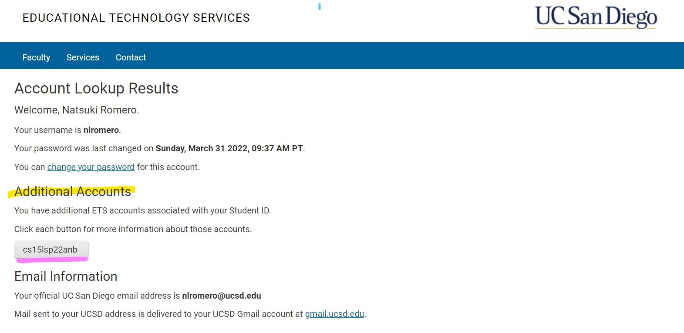
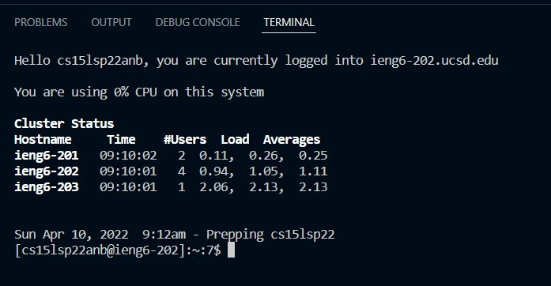
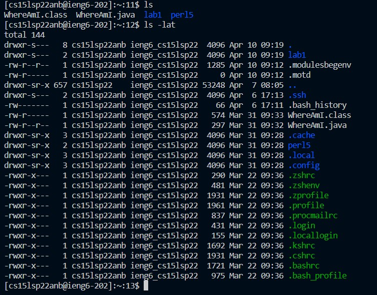

# Lab Report 1
How to log into a course-specific account on ieng6:  
## Installing VSCode  
- Use the link [VSCode Windows Install](https://go.microsoft.com/fwlink/?LinkID=534107) to Download VSCode to your computer. When it has been downloaded, and the installer has been run, it should open to look like this:

## Remotely Connecting  
- In order to connect using a course-specific account, you must first dowload [Install OpenSSH](https://docs.microsoft.com/en-us/windows-server/administration/openssh/openssh_install_firstuse).  
- Next, use [UCSD Account Lookup](https://sdacs.ucsd.edu/~icc/index.php) to find your username for your specified course. It will be listed under Additional Accounts (highlighted in yellow).

- Make a file in VSCode and open a new terminal. Then use the command $ ssh cs15lsp22anb@ieng6.ucsd.edu. Note that the part before the @ieng6.ucsd.edu matches the course specific account name as seen in the previous image (underlined in pink).
- If this is your first time attempting to log in, you will receive a message asking you to confirm that you want to log in. You will do this by entering $ yes.
- The system will then prompt you for a password. This password is the same as your global password (aka the one you use for AD Login). Note that for secutiry purposes, when you type into the password field there will be nothing to indicate that it is being typed, not even ***.
- If successful, you should see the message depicted below:

## Trying Some Commands  
- Now that you are remotely logged in, you may try some of the various Unix commands- these will respond with the corresponding results from the other computer and not yours!
- You should play around with the commands to familiarize yourself with them, but some commands to try are: *cd*, *ls*, *pwd*, *mkdir*, *cp*, and *cat*. Try different variations of them as well (e.g. *cd* and *cd~*, or try *cd* starting from different folders).

## Moving Files with scp  
- The command *scp* is very useful to programmers, as it allows them to copy files back and forth between their own computer and the one they are remotely logged into. It is important to note that this command is always run on the programmers own computer (make sure you are logged out of ssh!($ logout)).
- Create a file on your computer, and then use javac and java to compile and run it to ensure it works. Then use the command $ scp WhereAmI.java cs15lsp22anb@ieng6.ucsd.edu:~/. (You will have to enter your password.)
- Using the *ls* command should reveal that WhereAmI.java has been copied to the ieng6 computer. Log into the the ieng6 server, and you will then be able to run javac and java on file on the ieng6 computer.

## Setting an SSH Key  
- It can be annoying to type out your password so often, so the command *ssh-keygen* was created to help. This command creates a pair of keys (one on the client(your) side and one on the server(ieng6) side). These keys together form an alternate method of authentification.
## Optimizing Remote Running  