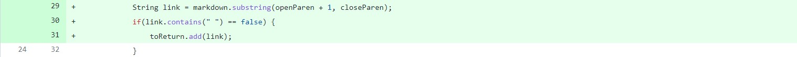
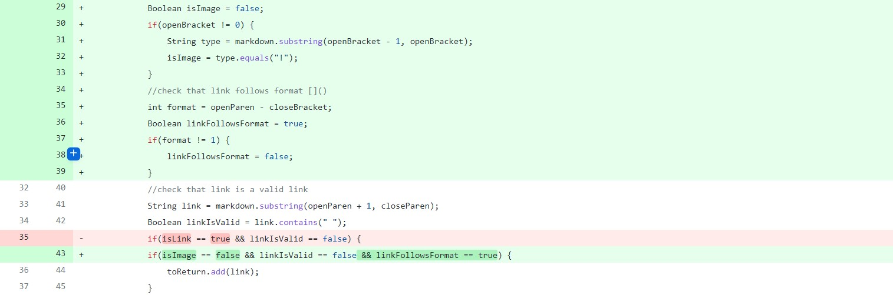

# Lab Report 2
Changing the code for MarkdownParse to run correctly on error-inducing code:  
## Change 1  
  
[Test file](https://github.com/natsukiromero/markdown-parser/blob/main/new-file.md)  
symptom: [https:// google.com, test-file.md, takenaga.jpg]  
**please note that the image is addressed in the next change

This failure-inducing test file included an invalid link, which we do not want to be added to the final list of links in the file. Originally, the code only checked for text that matched the format of links in markdown, so in order to fix the code we needed to test the validity of the link before adding it to our list. We did this by checking to make sure that the string between the open and closed parenthesis contained no spaces.  

## Change 2
  
[Test file](https://github.com/natsukiromero/markdown-parser/blob/main/new-file.md)  
symptom: [test-file.md, takenaga.jpg]  

This failure-inducing test file included a link to an image, which we do not want to be returned as it is not a link. Originally, the code only checked for brackets followed by parenthesis, which includes both images and links. To differentiate images from links, images were identified as text where the character before the open parenthesis is an exclamation point, and images were filtered out.  

## Change 3
  
[Test file](https://github.com/natsukiromero/markdown-parser/blob/main/test-file5.md)  
symptom: [page.com]  

This failure-inducing test file included a link where the brackets and paranthesis did not directly follow each other. The original code did not consider this, only looking for text inside parenthesis after it found a set of brackets. To amend this, the code was changed to filter out links where the open parenthesis did not directly follow the close bracket.
 
[return to home page](index.html)