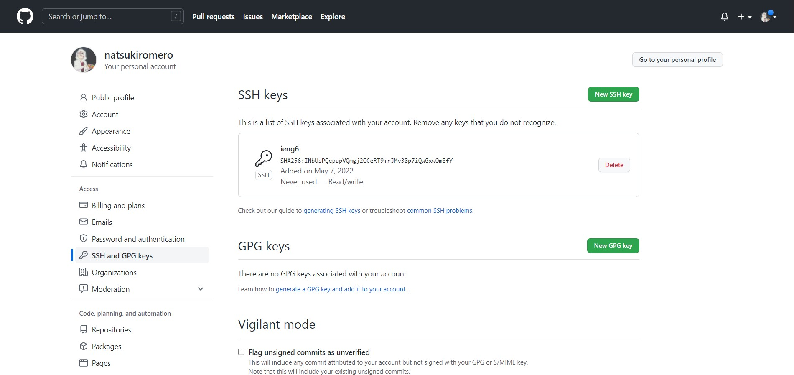
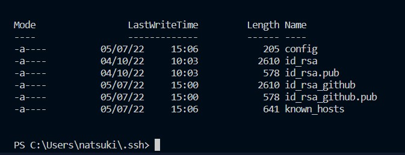
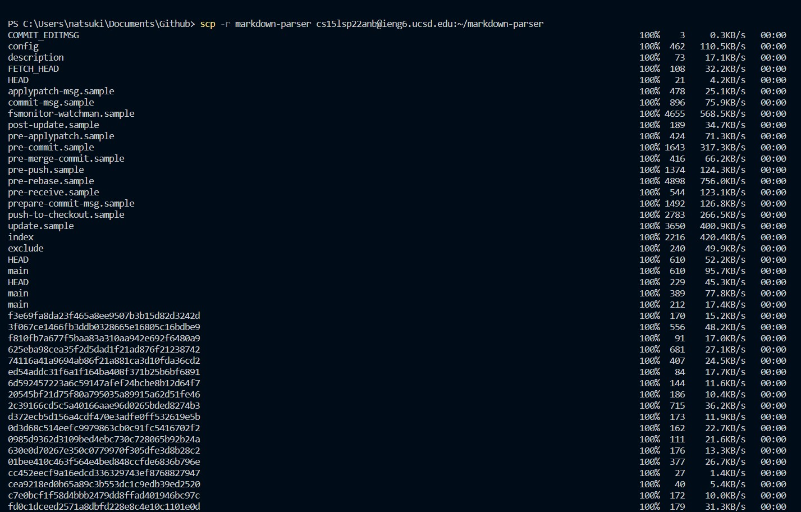

# Lab Report 3
More work with ieng6 <br>
## Streamlining ssh Configuration <br>
## Setup Github Access from ieng6 <br>
- ssh key stored in github: <br>
 <br>
- ssh key on user accoung: <br>
 <br>
## Copy whole directories with ```scp -r``` <br>
- using ```scp -r``` to copy markdown-parser to ieng6
 <br>