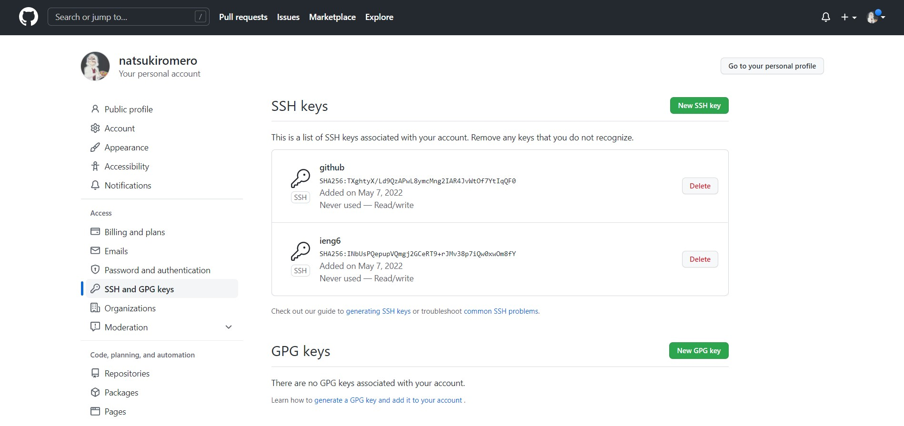
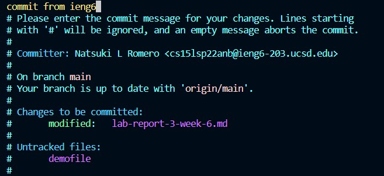

# Lab Report 3
More work with ieng6 <br>

## Streamlining ```ssh``` Configuration <br>
By creating a file ```.ssh/config``` and entering the necessary information, it is possible to create a shortcut for ```ssh```ing into remote accounts. Similar to how the id_rsa allows us to skip typing in our passcode, this file will eliminate the need to type out our full username. Therefore, the command goes from ```ssh cs15lsp22anb@ieng6.ucsd.edu``` to ```ssh ieng6```- much simpler and easier! <br>
<br>
 <br>
This also works for any time where we would've had to type out our remote account, such as ```scp```ing a file. <br>
<br>

## Setup Github Access from ieng6 <br>
- ```ssh``` key stored in github: <br>
 <br>
- ```ssh``` key on user account: <br>
 <br>
In order to commit and push to github directly from outhome computers, we must use some sort of token-based authentification systems like ```ssh``` keys. Storing them on github and the computer has the same effect as storing id_rsa keys on ieng6 and the home computer- allows us to login automatically. <br>
- commit from ieng6: <br>
The necessary commands to commit and push a file, in this case lab-report-3-week-6.md, are as follows: <br>
> ```git add lab-report-3-week-6.md``` <br>
> ```git commit``` <br>
> ```git push``` <br>

 <br>
After entering ```git commit```, the following text will prompt you to enter a message to accompany your commit. The instructions to use it are as follows: <br>
> type message <br>
> press 'esc' <br>
> type ":wq" and hit enter <br>

The commit message will be added, and this text will disappear.

 <br>

- [link to commit](https://github.com/natsukiromero/cse15l-lab-reports/commit/a8797473361ae5a3f2635605292868e1fbccf1bb) <br>

## Copy whole directories with ```scp -r``` <br>
- the command ```scp -r``` can be used to copy entire directories (such as markdown-parser) to ieng6: <br>
 <br>
- from there, we can log into the ieng6 server and compile and run MarkdownParseTest.java: <br>
 <br>
- combining it all into one line using ; and "":
 <br>
When I attempted to do this, I got the error "Disk quota exceeded," and an empty directory was copied into my ieng6 account. I believe that these commands are theoretically correct, but bc the few tutor hours were very busy, I was never able to verify that this would work.