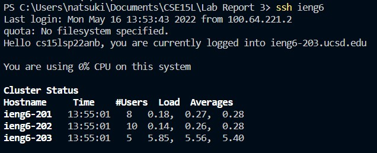

# Lab Report 3
More work with ieng6 <br>
## Streamlining ssh Configuration <br>
<br>
 <br>
<br>
## Setup Github Access from ieng6 <br>
- ssh key stored in github: <br>
 <br>
- ssh key on user accoung: <br>
 <br>
-commit from ieng6: <br>
 <br>
 <br>
[link to commit](https://github.com/natsukiromero/cse15l-lab-reports/commit/a8797473361ae5a3f2635605292868e1fbccf1bb) <br>
## Copy whole directories with ```scp -r``` <br>
- using ```scp -r``` to copy markdown-parser to ieng6
 <br>
- logging into ieng6 and running the tests
 <br>
- combining it all into one line:
disk quota exceeded, copies over empty directory???