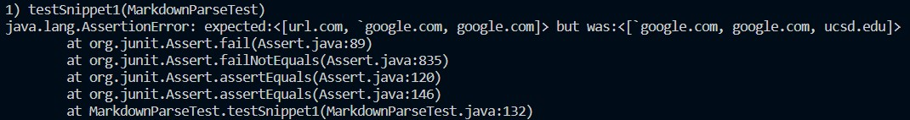
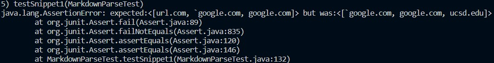
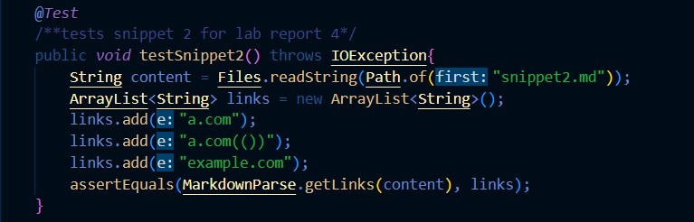
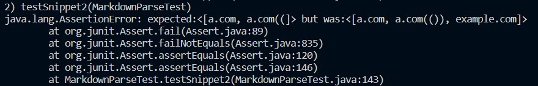
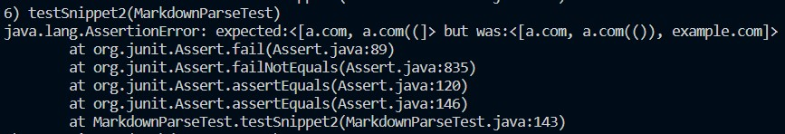
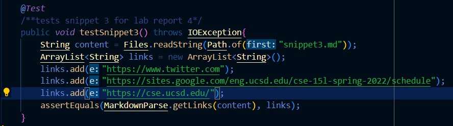
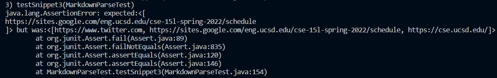

# Lab Report 4
testing MarkdownParse with various snippets  

## Repositories
[my repository](https://github.com/natsukiromero/markdown-parser)  
[other repository](https://github.com/tcarman/markdown-parser)  

## Snippet 1
Test written:  
  
Test Results in My Repo:  
  
Test Results in Other Repo:  
  
Corrections: I think that this case would be fixable. For the "url.com," I would add code that makes sure that a bactick is not present before [, similar to what I do for ! for Images. As for ucsd.edu, I may be able to adjust the code so that int closeBracket is the latter ]. My current code says that if ] and ( are not back to back, it is not a valid link, so by changing what the code views as ] would fix the problem. In other words, make sure to account for nested brackets. (Note: I have not thoroughly thought through the implications of whether or not this would mess up other test cases.)

## Snippet 2
Test written:  
  
Test Results in My Repo:  
  
Test Results in Other Repo:  
  
Corrections: Fixing my code for this snippet would be the same as proposed for snippet1- adjust the indexes used so that the last ) or ] (as considered by VSCode preview) is used. This way, the full a.com(()) would be printed, and example.com would not be ommitted.

## Snippet 3
Test written:  
  
Test Results in My Repo:  
  
Test Results in Other Repo:  
  
Corrections: Due to what I personally had considered a "valid link," any link with spaces in it was considered invalid. In order to return both twitter.com and cse.ucsd.edu, I would simply need to remove the few lines that filter those types of links out.
