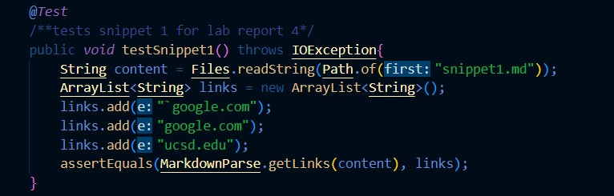

# Lab Report 4
testing MarkdownParse with various snippets  

## Repositories
[my repository](https://github.com/natsukiromero/markdown-parser)  
[other repository](https://github.com/tcarman/markdown-parser)  

## Snippet 1
Test written:  
  
Test Results in My Repo:  
  

## Snippet 2
Test written:  
  
Test Results in My Repo:  
  

## Snippet 3
Test written:  
  
Test Results in My Repo:  
  