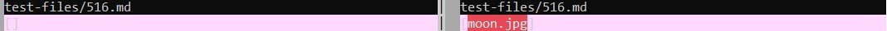
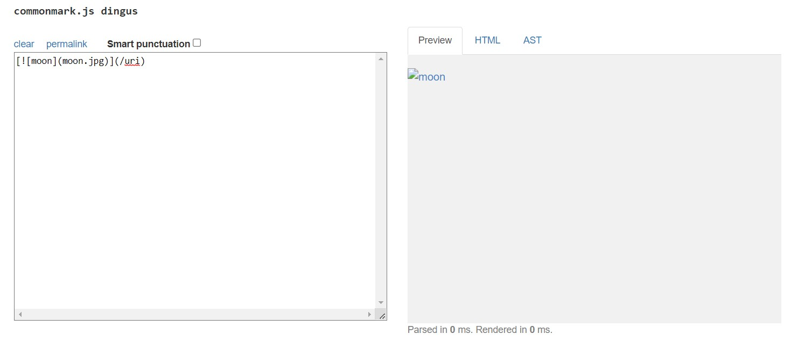
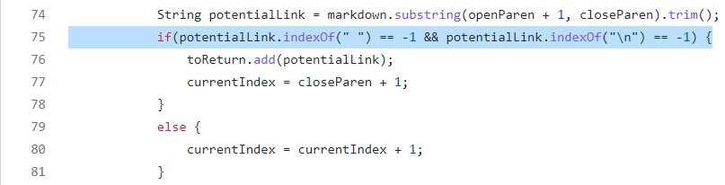
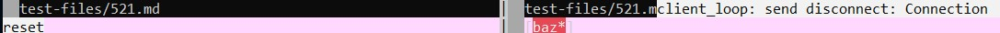
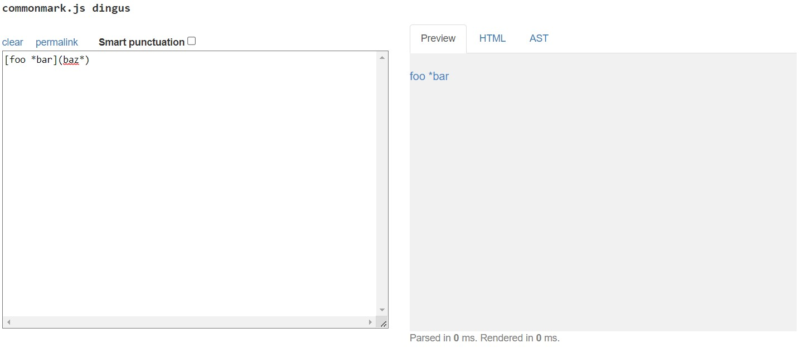
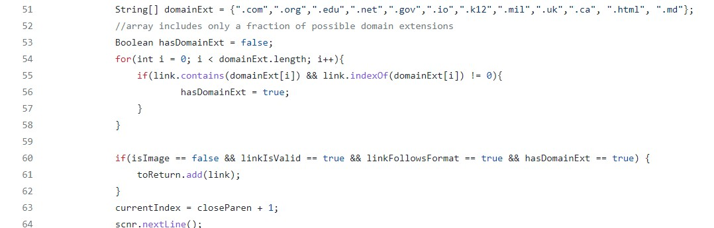

# Lab Report 5

To find the testfiles with different resuts, I directed the output of script.sh to a file using ```bash script.sh > results.txt```. Using ```vimdiff```, I compared the result.txt files of the given markdown-parser repository and my markdown-parser repository. Then, I picked at random some files that resulted in differences, and looked at the original file to see what it contained. This way, I could see why there may have been differences based on the MarkdownParse code, and pick files that corresponded to different bugs. 

## Test 1: [516.md](https://github.com/nidhidhamnani/markdown-parser/blob/main/test-files/516.md) <br>
- The given repository was not correct, but mine was. When we were first developing MarkdownParse.java, we had to take into consideration images, which are very similar in format to links. To combat this, I implemented code that checked for an exclamation point before the openBracket, therefore sorting images from links. The given repository did not do this.
- outputs: mine and the given respectively <br> 
 <br>
- expected output: according to the CommonMark demo site <br>
 <br>
- For the given repository, the bug lies in line 75, which adds the code to the ArrayList of results if it is formatted corectly. However, it fails to check if the character at openBracket - 1 is an !, which indicates an image. The code should check (not necessarily in that exact line) for that, and exclude the link if it leads to an image. <br>
 <br>

## Test 2: [521.md]
- The given repository was correct, but mine was not, as I discarded the link [baz*] from the results of running the test file. <br>
-outputs: mine and the given respectivelt <br>
<br>
- expected output: according to the CommonMark demo site <br>
<br>
- For my repository, the error lies in the portion of code depicted below. A few weeks ago, I decided that a good way to filter out invalid links was to check for proper domain extensions. Removing the lines of code that check for the domain extension and then requiring it as a condition of being passed to the results would fix this problem.<br>
<br>